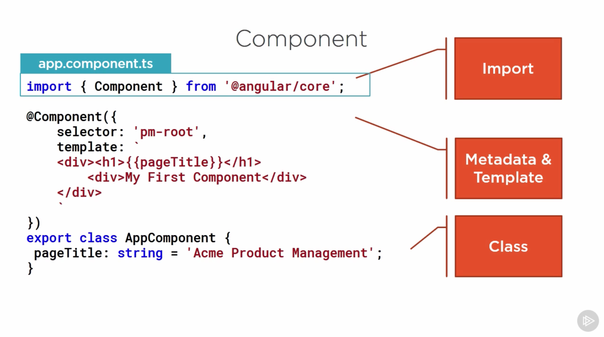
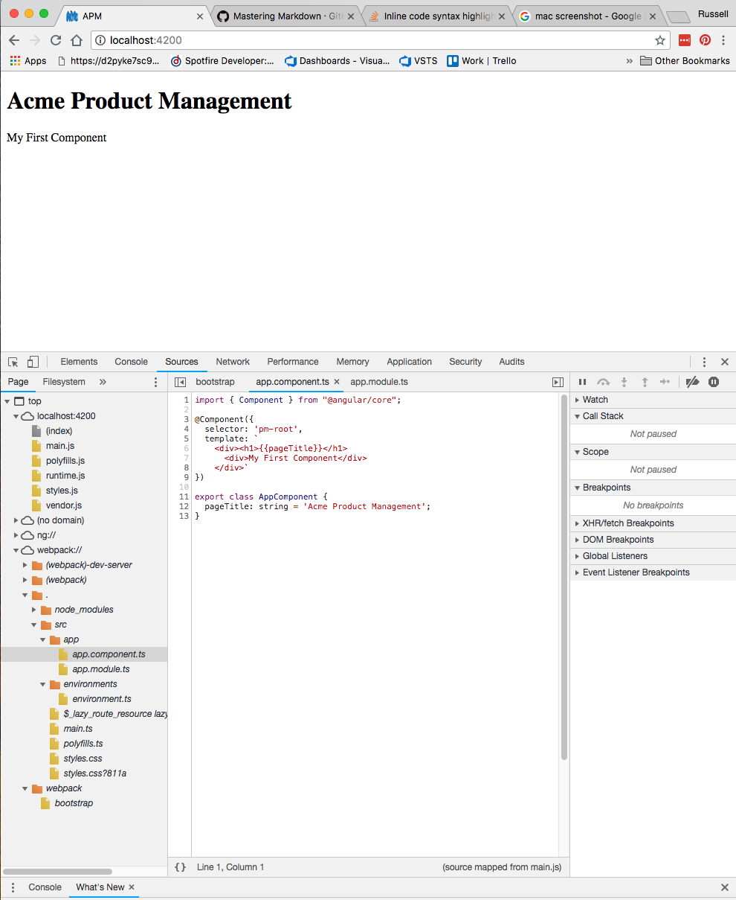
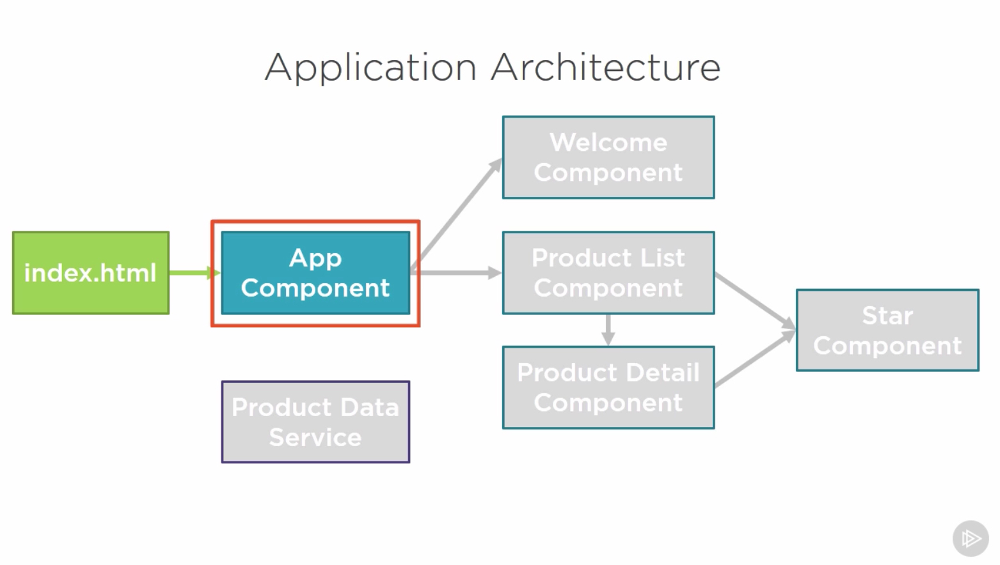

# First Things First

## Installing an Angular Application

First thing that needs to happen is to install all the dependencies in the form of node_modules. To see what dependencies need to be installed check out the [package.json](./package.json) which stores all the packages and versions needed to run the project. These packages can be installed by navigating to the same folder as the package.json in terminal/cmd and then executing:

```bash
npm install
```

Visual studio code has a nice feature where it will allow you to right click open in terminal from the same folder making this very easy.

## Running an Angular Application

The [package.json](./package.json) file also holds the startup code for the application. The first block at the top determines what the start command is.

```json
{
  "name": "apm",
  "version": "0.0.0",
  "scripts": {
    "ng": "ng",
    "start": "ng serve -o",
    "build": "ng build",
    "test": "ng test",
    "lint": "ng lint",
    "e2e": "ng e2e"
  },
```

For this project it is `ng serve -o` which is common for most applications. The O stands for open and will open the application in the default browser. To start the app open terminal/cmd and make sure you are in the same folder as the package.json then run:

```bash
npm start
```

 It should open up your default browser with an interactive web session hosted by a local web server started up on your computer. To stop this web server hit ctrl or cmd + c in the terminal window where you started it.

## About Modules

There are Four kinds of modules, but we will only focust on the latter two.

1. AngularJS Modules
1. Typescript Modules
1. ES 2015 Modules
1. Angular Modules

### ES 2015 Modules

These help organize our Code files. It makes us able to import or export things such as components. To export a component from a file called product.ts we would use the below syntax.

product.ts

```typescript
export class Product {

}
```

If we then wanted to use that component in another component (like our product-list.ts file below) or module we would then import it like below:

product-list.ts

```typescript
import { Product } from './product'
```

### Angular Modules

Angular Modules help orgainze our application into blocks of functionality. These modules can be shared or private. Components and dependencies get declared by a root module. They promote boundaries between our application.

# Introduction to Components

## What is a component

A component is a view defined by a template, code defined by a class, and metadata defined by a decorator.

* Template
  * View layout
  * Written in HTML
  * Contains binding and directives
* Class
  * Code supports the view
  * Written in Typescript
  * Contains Properties and Methods
* Metadata
  * Extra data for angular
  * Defined with a decorator

Below is an example component used by the app.component.ts file, which is our main app component.



The `import` section gets the component ES module from angular core.

The `metadata & template` component section declares what the selector for this class can be referenced by in html, and what the template html looks like. This section can also reference where the html template file, and css styling files are located in the app.

Lastly, the `class` section, which in this example contains just one property of pageTitle. That Property is referenced in the HTML template by `{{pageTitle}}` so will update dynamically based on what the value of the pageTitle property of the AppComponent class. The property is written in *camel case*, meaning first letter is lowercase, then every first letter of words after that are capitalized. The `property name` then has a `:` and `type` assocatied with that property. This class then has a `default value` associated with it after an `=` wrappend in single quotes.

### Defining the Metadata with a Decorator

A `decorator` is a function that adds metadata to a class, its members or method arguments. Metadata can be things like a:

`selector`: the custom HTML tag called a `directive` which can be used to tell angular where this is supposed to go in our app's HTML

`template`: the HTML that our component uses to display or do what we want it to do

This usually goes right before the class in the code file. The component is a function, and does not end in a semicolon. In a html template data binding can be done using double curley braces.

### Importing what we need

Import statements are part of ES 2015 and is similar to C# `Using` statement. Other Modules can import our components as long as they are exported. Angular is also built using modules. When we need methods or properties from angular we also can import those modules from one of the Angular modules below.

* @angular/core
* @angular/animate
* @angular/http
* @angular/router

Every Component class should import the member Component so it can create the `@component` decorator.  

```typescript
import { component } from '@angular/core';
```

## Demo: Creating the App Component

The below code can be written from scratch in the `app.component.ts` to create a new component.

```typescript
import { Component } from "@angular/core";

@Component({
  selector: 'pm-root',
  template: `
    <div><h1>{{pageTitle}}</h1>
      <div>My First Component</div>
    </div>`
})

export class AppComponent {
  pageTitle: string = 'Acme Product Management';
}
```

This component will add a header1 style title that displays whatever the `pageTitle` property of our `AppComponent` class is, and then have the unstyled text 'My First Component' added after that. The selector for this is `pm-root` so any html that adds the `pm-root` directive like so:

```html
<pm-root></pm-root>
```

will load up this component and add the title and body text declared in our template html.

## Bootstrapping our app component

Now that we have a component, how does angular know to load our code? It looks for the selector in the HTML being loaded, which in this case is the index.html. It then looks in an angular module to try to find where the code is for that custom selector. The next step is to declare the component in an angular module. this happens in the [app.module.ts](./src/app/app.module.ts)

```typescript
import { BrowserModule } from '@angular/platform-browser';
import { NgModule } from '@angular/core';

import { AppComponent } from './app.component';

@NgModule({
  declarations: [
    AppComponent
  ],
  imports: [
    BrowserModule
  ],
  bootstrap: [AppComponent]
})
export class AppModule { }
```

Modules look a lot like components. We export the class, include a decorator and import other modules. For this module we import a few external modules. The BrowserModule is to let angular load the code in a browser to display correctly, the ngModule gets the `@NgModule` decorator which signifies this as an angular module, and then we import our `AppComponent` so that it can be bootstrapped by our application.

In the `@NgModule` decorator we declare an array of declarations, or which components belong to this module. For this app we just have our `AppComponent`, but it could be a list of components seperated by commas. Finally the Bootstrap keyword tells angular which component should be used as the startup component. This should almost always be the `AppComponent` for main modules like this.

### Checklist

Class -> Code
Decorator -> Metadata
Import what we need

#### Code

Give the component class a clear name. Pascal case for classes and append component to the end of the name. Make sure to use the `export` keyword so it can be imported by modules or other components.
camelcase for properties and methodnames.

#### Metadata

Component decorator, prefixed with `@` and use `()` since it is a fucntion. Prefix the selector for clarity. Selector isn't needed if you don't use this component in HTML. Template is the view's HTML.

#### Import

Defines what members the component needs. Uses the `Import` keyword. Member name (what is inside the `{ memberName }`) is case sensitive. The path to the module should be in single quotes, and shouldn't include the extension of the file.

#### Something is wrong

f12 in the browswer to open developer tools. You can find your code under the sources tab, in webpack:// then . and src is where the code files are as seen in the screenshot below.



you can also add breakpoints in your code on this page. Things to look for when troubleshooting broken code are:

* Unclosed tags/braces
* Proper casing

Otherwise check [blog post](http://blogs.msmvps.com/deborahk/angular-2-getting-started-problem-solver/) in case there were some breaking updates in some of the dependencies.

Then post a comment on the discussion page on the [comments page](https://app.pluralsight.com/library/courses/angular-2-getting-started-update/discussion) of pluralsight.

### Summary

Figured out what a component is
Created a component class
Defined the Meta data with a decorator
Imported what we needed
Bootstrapped our app component

The image below shows the final architecture of our app. In this module we created the app component section of the diagram.



Next is taking a closer look at templates, and creating the product list component.

# Templates, Interpolation, and Directives

Web apps are all about the user interface, and angular makes this easy to do. Now we will focus on techniques to build out the template.

## Overview

Build a Template
Using a Compenent as a Directive
Binding with Interpolation
Adding logic with Directives

## Building a Template

Templates can be built inline using a quoted or ES 2015 back ticks so that it can be multi-line. The better way is to use a linked template that is referenced in the `@Component` decorator with the path to the .html file.

We will make a heading, filter by box, show what is filtered to, a table with nicely formatted headers, and a show-hide toggle button.

### Adding styles

The styling will be done using [bootstrap](https://getbootstrap.com/) and [fontAwesome](https://fontawesome.com)

First install boostrap and fontawesome.

```bash
npm install bootstrap font-awesome
```

The warnings about needing jquery and popper don't matter to us since we just need the style sheets.

These style sheets got downloaded to the node modules folder under the path [~bootstrap/dist/css/bootstrap.min.css](./node_modules/bootstrap/dist/css/bootstrap.min.css) and [~font-awesome/css/font-awesome.min.css](./node_modules/font-awesome/css/font-awesome.min.css) respectively. the .min means they are minimized so they have no spaces or any characters not needed to run successfully. The next step to use these is to import them into our [styles.css](./src/styles.css) file.

```css
@import "~bootstrap/dist/css/bootstrap.min.css";
@import "~font-awesome/css/font-awesome.min.css";
```

This file is a global style sheet, so these styles are now available to any template in our application.

### Adding the template HTML file

By convention all angular components should have their own folder under the app folder. Since this is the Products component create a products folder resulting in this path `./src/app/products`

Then create the `product-list.component.html` file. The convention for this is to have it be the same name as the component with a .html extension.

```html
<div class='card'>
    <div class='card-header'>
        Product List
    </div>
</div>
```

The contents of the file so far will just be the title of the section, with some of the `bootstrap styles` thrown in. Next we need to add the `filter by` text box as well as the filtered by sub header section for when something is actively being filtered.

```html
<div class='card'>
    <div class='card-header'>
        Product List
    </div>
    <div class='card-body'>
        <div class='row'>
            <div class='col-md-2'>Filter By:</div>
            <div class='col-md-4'>
                <input type='text' />
            </div>
        </div>
        <div  class='row'>
            <div class='col-md-6'>
                <h4>Filtered by: </h4>
            </div>
        </div>
    </div>
</div>
```

This is again using bootstrap styling classes to create the headers. Then the `<input>` tag adds a user control of type text box. I think the styling for that is handled by the div it is contained within, but the functionality comes for free with bootstrap. Next is to add the product list table.

```html
<div class='card'>
    <div class='card-header'>
        Product List
    </div>
    <div class='card-body'>
        <div class='row'>
            <div class='col-md-2'>Filter By:</div>
            <div class='col-md-4'>
                <input type='text' />
            </div>
        </div>
        <div  class='row'>
            <div class='col-md-6'>
                <h4>Filtered by: </h4>
            </div>
        </div>
        <div class='table-responsive'>
            <table class='table'>
                <thead>
                    <tr>
                        <th>
                            <button class='btn btn-primary'>
                                Show Image
                            </button>
                        </th>
                        <th>Product</th>
                        <th>Code</th>
                        <th>Avialable</th>
                        <th>Price</th>
                        <th>5 Star Rating</th>
                    </tr>
                </thead>
                <tbody>

                </tbody>
            </table>
        </div>
    </div>
</div>
```

There are a lot of tags going on for table creation, here are what they mean.

`<div class='table-responsive'>` is a bootstrap style that allows the table to scroll horizontally on smaller screens.

`<table>` tag creates the table.

`<thead>` allows for customization of the table headers.

`<tr>` creates a table row, and header rows is considered a row.

`<th>` creates headers which are by default scoped to rows (header row on the top), but can also be scoped to the side (so header rows down the first column.)

`<tbody>` is where data is populated for the table. Since we don't want to hard code the data in we can leave this blank for now.

Next is to build the component to use this template.

## Building the Component

The steps are:

* define a class
* add a @component decorator
* import the needed modules

Create the file in the products folder called [product-list.component.ts](./src/app/products/product-list.component.ts)

```typescript
import { Component } from "@angular/core";

@Component({
    selector: 'pm-products',
    templateUrl: './product-list.component.html'
})

export class ProductListComponent {
    pageTitle: string = 'Product List';
}
```

Only thing different from the app component is that we are using the `templateUrl:` decorator instead of the inline template one.

Next we need to hook this new component up to our app.

## Using a component as a Directive

There are two steps to add a component to our app.

1. add a directive (custom HTML tag) to the index.html
1. add an the new component to declaration decorator and import of our root [app.module.ts](./src/app/app.module.ts)

First add the directive to the template of our [app.component.ts](./src/app/app.component.ts) file.

```typescript
@Component({
  selector: 'pm-root',
  template: `
    <div><h1>{{pageTitle}}</h1>
      <pm-products></pm-products>
    </div>`
})
```

This tells our app where our component should show up. This custom HTML tag we added is called a `directive` and is how html implements angular components.

If we run our app now it won't work, but it will provide a helpful error in the console. The problem is the directive we added isn't know by our [app.module.ts](./src/app/app.module.ts). The error also gives a solution to the problem, which would be to add the component 'pm-products' to the app module. So let's do just that.

In our [app.module.ts](./src/app/app.module.ts) file add `ProductListComponent` to our the declarations decorator and then import the `ProductListComponent` from our file.

```typescript
import { BrowserModule } from '@angular/platform-browser';
import { NgModule } from '@angular/core';

import { AppComponent } from './app.component';
import { ProductListComponent } from './products/product-list.component';

@NgModule({
  declarations: [
    AppComponent,ProductListComponent
  ],
  imports: [
    BrowserModule
  ],
  bootstrap: [AppComponent]
})
export class AppModule { }
```

If using VS Code with angular extensions enabled when you start typing in the declarations array it will autocomplete the component name `And` add the appropriate import statement. Pretty cool!

Now the page should show up. It won't do anything, but it is all there.

Next step is to add some functionality to our app with data binding and some built in directives.

## Binding with Interpolation

Binding coordinates communication between a component's class and its template, which often involves passing in data.

the class can pass data to the template, and in reverse the template can raise events that trigger the class methods or pass in user ented values to the properties. Binding syntax is defined in the template.

### Interpolation

interpolation is a one way class binding from the class to the template. We use interpolation to call the strings between double curley braces. Some examples of template interpolation are:

Class file

```typescript
export class AppComponent {
  pageTitle: string = 'Acme Product Management';
  
  getTitle(): string {...};
}
```

Template file

```html
<h1>{{pageTitle}}</h1>

{{'Title' + pageTitle}}

{{2*20+1}}

{{'Title: ' + getTitle()}}

<h1 innerText={{pageTitle}}></h1>
```

The template Expression is what is between the two curley braces. Angular executes the code between the two, then converts them to a string and returns them on the page as a read only.

Lets change the hard coding of the page title in our `product-list` component.

This is done by changing the [product-list.component.html](./src/app/products/product-list.component.html)

From 

```html
        <div class='card-header'>
            Product List
        </div>
```

to

```html
        <div class='card-header'>
            {{pageTitle}}
        </div>
```

## Adding Logic with Directivies: nglf

Angular has built in directives. We will use structural directives in this section

* `ngIf`: If logic
* `ngFor`: For loops

`ngIf` is a structural directive that removes or shows elements from the dom. If the condition is true it is inserted, if it is false then it is removed.

```html
<div class='table-responsive'>
    <table class='table' *ngIf='products && products.length'>
        <thead> ...
        </thead>
        <tbody> ...
        </tbody>
    </table>
</div>
```

This example shows how we could show or hide the products table. If there are no products and data in the products class it will not show the table. All elements in that table class will be removed from the DOM. If there are products and product data in the class then it is inserted into the DOM and will be displayed.

Since these directives are not native to HTML we still need to load them so our HTML can find them. Luckily the Browser module gives us the `*ngIf` and `*ngFor` directives, and since that is imported into the app module already then all our templates within that module have access to these commands.

### Show/hide the table

To start we need to have a **property** to hold the items for our table in our [product-list.component.ts](./src/app/products/product-list.component.ts)

```typescript
import { Component } from "@angular/core";

@Component({
    selector: 'pm-products',
    templateUrl: './product-list.component.html'
})

export class ProductListComponent {
    pageTitle: string = 'Product List';
    products: any[] = [
        {
            "productId": 1,
            "productName": "Leaf Rake",
            "productCode": "GDN-0011",
            "releaseDate": "March 19, 2016",
            "description": "Leaf rake with 48-inch wooden handle.",
            "price": 19.95,
            "starRating": 3.2,
            "imageUrl": "https://openclipart.org/image/300px/svg_to_png/26215/Anonymous_Leaf_Rake.png"
          },
          {
            "productId": 2,
            "productName": "Garden Cart",
            "productCode": "GDN-0023",
            "releaseDate": "March 18, 2016",
            "description": "15 gallon capacity rolling garden cart",
            "price": 32.99,
            "starRating": 4.2,
            "imageUrl": "https://openclipart.org/image/300px/svg_to_png/58471/garden_cart.png"
          }
    ];
}
```

The property added is called `products` which we are going to give the type of array that holds objects of type `any`. We will use a better type later, but for now the type of `any` is used in cases when we don't know what type the objects are going to be, or we don't care what they will be. Then we will hard code two products in our array. This will be handled by a service later, but for now we will use this hardcoding.

Next is to update the **template** to use `*ngIf` so that our table only appears if there are items in it. This is done in the [product-list.component.html](./src/app/products/product-list.component.html) file. We add the if statement to the `<table>` tag

```html
<div class='card'>
        <div class='card-header'>
            {{pageTitle}}
        </div>
        <div class='card-body'>
            <div class='row'>
                <div class='col-md-2'>Filter By:</div>
                <div class='col-md-4'>
                    <input type='text' />
                </div>
            </div>
            <div  class='row'>
                <div class='col-md-6'>
                    <h4>Filtered by: </h4>
                </div>
            </div>
            <div class='table-responsive'>
                <table class='table'
                            *ngIf='products && products.length' >
                    <thead>
                        <tr>
                            <th>
                                <button class='btn btn-primary'>
                                    Show Image
                                </button>
                            </th>
                            <th>Product</th>
                            <th>Code</th>
                            <th>Avialable</th>
                            <th>Price</th>
                            <th>5 Star Rating</th>
                        </tr>
                    </thead>
                    <tbody>

                    </tbody>
                </table>
            </div>
        </div>
    </div>
```

This checks to see if there is products property, and makes sure that there are some items in the proudcts array. If you refresh the web app nothing should have changed, but if you then comment out the products we hard coded in the `products` property, then the table should disapear. Once we add it again it should re-appear.

Next we need to populate our table with the products using `*ngFor`.

## Adding Logic with Directives: *ngFor

`*ngFor` is a for loop that repeats whatever we define for however many items are in a list. This can be used to create a whole table of rows by defining just what one row should look like.

```html
<tr *ngFor='let product of products'>
    <td></td>
    <td>{{ product.productName }}</td>
    <td>{{ product.productCode }}</td>
    <td>{{ product.releaseDate }}</td>
    <td>{{ product.price }}</td>
    <td>{{ product.starRating }}</td>
</tr>
```

`products` is an array from our [product-list.component.ts](./src/app/products/product-list.component.ts). The array of products is what we will be iterating through in the table data elements below. `let` creates a template input variable call product. It can be referenced anywhere on the element, or sibling or child element in the html. `product` is the name of the variable we create as the `*ngFor` loop iterates through our `products`.

Then in all the table data rows we use interpolation to one way bind to the properties of our products array property. each attribute in the array can be accessed with dot notation referenced by the name in the json.

we will add this code to our [product-list.component.html](./src/app/products/product-list.component.html) file inbetween the open and closing tags of the `<tbody></tbody>` elements.

```html
                    </thead>
                    <tbody>
                        <tr *ngFor='let product of products'>
                            <td></td>
                            <td>{{ product.productName }}</td>
                            <td>{{ product.productCode }}</td>
                            <td>{{ product.releaseDate }}</td>
                            <td>{{ product.price }}</td>
                            <td>{{ product.starRating }}</td>
                        </tr>
                    </tbody>
```

After doing that it should show up in our app displaying all the products we have hard coded so far. Since we used the `*ngFor` loop we only had to define what a row should look like once, but we used the `of` keyword instead of the `in` keyword. For of loop iterates through an array returning each object and properties, while an `in` loop iterates through the objects index. This is best remembered by thinking of `in` does index.

## Checklists and Summary

### Inline templates

* for short templates
* specify `template` property in decorator
* use ES 2015 back ticks for multiple lines
* watch out for syntax or spelling issues

### Linked Template

* for longer templates
* specify the `templateUrl` property in decorator
* define path to external html file

### Component as a directive

1. declare the component as a directive (ex: `<pm-products></pm-products>`)
1. declare the component in the app module

### Interpolation

One way binding

* From component class property to an element property in our html

Defined with double curley braces

* Contains a template expression (ex. {{ 1 + 1}}, {{ product.productName }})
* No quotes needed

### Structural Directives

*ngIf and *ngFor

* Prefix with an asterisk
* Assign to a quoted string expression

*ngIf

* Expression is evaluated as true or false
* Can be used to show or hide elements from the DOM in HTML

*ngFor

* define local variable with let
* use of instead of in (ex. *ngFor='let product of products')

Next lets look at more interactive data bindings

# Data Binding & Pipes

We want to bind DOM elements to the component properties. This allows us to change fonts or styling based on user input, bind to database objects, or react to use inputs/actions. respond with click of a button to hide or show buttons.

## Property Binding

One way binding from the source to the target element.

```html

```

The Binding target is enclosed in `[ ]` while the binding source is enclosed in `''`. In this example we are binding the product.imageUrl to the `src` property of the img element (meaning where the browswer should be looking for our image). We will use property binding to bind the source of the product image.

in our [product-list.component.html](./src/app/products/product-list.component.html) file add an image tag beween the two table data tags and property bind the src and title properties of the image tag to the imageUrl and productName properties of our product class.

```html
....
                    <tbody>
                        <tr *ngFor='let product of products'>
                            <td>
                                
                            </td>
                            <td>{{ product.productName }}</td>
....
```

This should show some images, but they are super big. If you hover over the images you should also see the title if you hover over the images. To fix this sizing lets add some styles to our [product-list.component.ts](./src/app/products/product-list.component.ts) file.

We can add properties for size to our componenet class and then do property binding again to set it for all images in our table.

```typescript
export class ProductListComponent {
    pageTitle: string = 'Product List';
    imageWidth: number = 50;
    imageMargin: number = 2;
....
```

We can then bind to these properties in our image tag back in our [product-list.component.html](./src/app/products/product-list.component.html) file.

```html
                    <tbody>
                        <tr *ngFor='let product of products'>
                            <td>
                                
                            </td>
```

Since the `imageWidth` and `imageMargin` properties are not properties of our products array, but properties of our component class itself they aren't referenced by `product.imageWidth` for example. Next to make the show/hide button work with two way binding.

## Handling Events with Event Binding

Event binding listens for an event on an element and triggers a method or something else to happen when it does. The syntax is very similar to property binding, but uses `()` instead.

```html
<button (click)='toggleImage()'>
```

The name of the bound or target event is enclosed in `()` and then to the right of the event is the template  statement (often a method in a component). If the defined event occurs, then the template statement code is executed. Mozzilla documentation has a good list of [DOM accepted web events](https://developer.mozilla.org/en-US/docs/Web/Events).

Now lets make the show image button work. First thing is to add some properties and methods to our [product-list.component.ts](./src/app/products/product-list.component.ts).

```typescript
    showImage: boolean = false;
...
    toggleImage(): void {
        this.showImage = !this.showImage;
    }
```

The `showImage` property will hold the value of if the images should be shown or hidden.  Then the `toggleImage` method will set the showImage method to the opposite of what it is now. Since this is a boolean, booleans state can be flipped by adding a ! (commonly reffered to as a bang operator) to the beginning of the statement. The first time the button is pressed it goes through this logic.

1. showImage is `false` by default
1. toggle button pressed
1. toggleImage method sets this instance of the component's showImage property equal to the opposite of what it currently is when run

Next thing is to setup the button in the [product-list.component.html](./src/app/products/product-list.component.html) to execute our `toggleImage` method and use `*ngIf` to determine if we need to display or hide the images.

```html
                    <thead>
                        <tr>
                            <th>
                                <button class='btn btn-primary' (click)='toggleImage()'>
                                    Show Image
                                </button>
.....
                    <tbody>
                        <tr *ngFor='let product of products'>
                            <td>
                                
                            </td>

```

Using event binding we bind the button `click` event to our new toggleImage method. Since that method is a function with no parameters we put () at the end.

Next we can add a `*ngIf` to the img tag so we can check the showImage property and only show the images if it is true. This should work, but it looks weird since the button text doesn't change.

to fix this we can add binding to the `showImage` property using interpolation and a conditional operator to toggle the text. First add {{ showImage }} to the [product-list.component.html](./src/app/products/product-list.component.html).

```html
                            <th>
                                <button class='btn btn-primary' (click)='toggleImage()'>
                                    {{ showImage  ? 'Hide' : 'Show' }} Image
                                </button>
                            </th>
```

We can then use the conditional operator `?` to change the output depending on what the value of showImage is. The left side of the colon is returned if it is true, and the right side if it is false. So in english it says if showImage is true the say Hide, if showImage is false then say show.

Next it is time for some two way binding to use two-way binding.

## Handling input with Two-way binding

Two way binding takes input from a user and passes it to a class, and can take info from a class and pass it back to a user. this can be referenced with the `ngModel` directive. The syntax in html looks like this:

```html
<input [(ngModel)]='listFilter'>
```

The `ngModel` directive needs to be enclosed in parenthesis and square brackets. The square brackets indicate property binding from the class to the element. The parenthesis indicate event binding to notify the class of changes from the template. The order of the two can be rememberd by thinking about a banana in a box [()].

ngModel is a new directive, so we need to make sure it is accessible in our template by adding it to our module. Since our product-listComponent is owned by our AppModule we need to import the ngModule from the `formsModule` that holds the ngModule directive to our appModule.

to start add a `listFilter` property to our [product-list.component.ts](./src/app/products/product-list.component.ts) class.

```typescript
export class ProductListComponent {
    pageTitle: string = 'Product List';
    showImage: boolean = false;
    imageWidth: number = 50;
    imageMargin: number = 2;
    listFilter: string = 'cart';
....
}
```

This property will hold the string that our list of objects will be filtered by. Now that our component has a property it is time to add the two way binding to our text box.

We will use the `ngModel` directive with the banana box in the [product-list.component.html](./src/app/products/product-list.component.html) to allow for two way binding. The `[(ngModel)]='listFilter'` addition will bind the `listFilter` property to the input tag that holds our textbox. This will two way bind to our listFilter property on our component to the text box, and when someone adds something to our text box it will be passed back to our `listFilter` property.

```html
            <div class='row'>
                <div class='col-md-2'>Filter By:</div>
                <div class='col-md-4'>
                    <input type='text'
                        [(ngModel)]='listFilter' />
                </div>
            </div>
            <div  class='row'>
                <div class='col-md-6'>
                    <h4>Filtered by: {{listFilter}}</h4>
                </div>
            </div>
```

Executing this code will cause an issue since our AppModule doesn't have access to the `ngModel`. To get this to succeed we need to import the `FormsModule` to our [app.module.ts](./src/app/app.module.ts).

```typescript
import { BrowserModule } from '@angular/platform-browser';
import { NgModule } from '@angular/core';
import { FormsModule } from '@angular/forms'
import { AppComponent } from './app.component';
import { ProductListComponent } from './products/product-list.component';

@NgModule({
  declarations: [
    AppComponent,ProductListComponent
  ],
  imports: [
    BrowserModule,FormsModule
  ],
  bootstrap: [AppComponent]
})
export class AppModule { }
```

Adding an import statement for `FormsModule` and including it in the imports array in the decorator will allow our app to use the `ngModel` directive.

## Transforming Data with Pipes

Pipes change how bound data is displayed. They can be added to any kind of binding including interpolation, property binding, or two way binding. It can do things like put the data to uppercase, lowercase, currency, format as json, or many other things.

```html
{{ product.productCode | lowercase }}


```

Pipes can also be chained, so you could do a currency pipe that would add all uppercase USD to the end of a currency field, and then pipe in lowercase to change that to a lowercase USD. 

```html
{{ product.price | currency | lowercase}}
```

Pipes can also take paramaters shown by adding a : after the pipe name.

```html
{{ product.price | currency:'USD':'symbol':'1.2-2'}}
```

For the currency pipe above we set the currency type to USD, and show the currency symbol instead of the USD abbreviation, then we define how many decimals we want. 1 means at least one character to the left of the period, the first two means at minimum two decimal places to the right and the second 2 means at most two decimal places to the right. This should give us the standard format for how we see things in US Dollars.

Next lets add some pipes to format our data in the [product-list.component.html](./src/app/products/product-list.component.html). Lets add a lowercase pipe to the product code, and a currency pipe to our price.

```html
                            </td>
                            <td>{{ product.productName }}</td>
                            <td>{{ product.productCode | lowercase }}</td>
                            <td>{{ product.releaseDate }}</td>
                            <td>{{ product.price | currency:'USD':'symbol':'1.2-2' }}</td>
                            <td>{{ product.starRating }}</td>
                        </tr>
```

Just adding a pipe character then lowercase will do what we want for product code, and after adding a few parameters for the currency pipe we can display currency just how we want it.

## Checklist and Summary


# More on Components

Styles are encapsulated, pipes transform data better, and lifecycle hooks are used appropriately.

* Strong typing and interfaces
* Encapsulate styles
* Lifecycle hooks
* Custom Pipes
* Nested Components

## Defining interfaces

Strong typing means that we assign types to properties and variables which makes for fewer errors, and better tooling. When there isn't a type for what we want to use, instead of using any, we can create our own custom type called an interface.

Interface is a `specification` identifying a related set of properties and methods. It tells us what we can expect from any object referenced by this type. A class can adhere to the interface by `implementing` it. Then the interface gets used as a `data type`.

ES5 and ES2015 don't use interfaces, but typescript does so when it is transpiled they get removed. 

```typescript
export interface IProduct {
    productId: number;
    productName: string;
    productCode: string;
    releaseDate: Date;
    price: number;
    description: string;
    starRating: number;
    imageUrl: string;
    calculateDiscount(percent: number): number;
}
```

The interface above has `export` so that we can access it by other classes, `interface` letting typescript know this is an interface, then the `interface name` which commonly starts with I, but not always. The interface then has all the property names and types as well as a blueprint for what a method called calculateDiscount would expect and return.

To use the interface in another class, you import the interface, then use it as a datatype.

```typescript
import { IProduct } from './product';

export class ProductListComponent {
    pageTitle: string = 'Product List';
    showImage: boolean = false;
    listFilter: string = 'cart';

    products: IProduct[] = [...];

    toggleImage(): void {
        toggleImage(): void {
            this.showImage = !this.showImage;
        }
    }
}
```

In the example above we `import` the `IProduct` interface and then use it as the type for our `products array`. That lets typescript know that our `array` called `products` should be filled with objects of the type `Iproduct`. Lets use this in our code by changing our array of any to type of IProduct.

first create a file [product.ts](./src/app/products/product.ts) to hold our interface.

```typescript
export interface IProduct {
    productId: number;
    productName: string;
    productCode: string;
    releaseDate: string;
    price: number;
    description: string;
    starRating: number;
    imageUrl: string;
}
```

Similar to the example interface we will create this interface with no methods since this type is just holding objects with these properties. Next lets change that array to use our IProducts interface instead of the any type in [product-list.component.ts](./src/app/products/product-list.component.ts).

```typescript
import { Component } from "@angular/core";
import { IProduct } from "./product";

@Component({
    selector: 'pm-products',
    templateUrl: './product-list.component.html'
})

export class ProductListComponent {
    pageTitle: string = 'Product List';
    showImage: boolean = false;
    imageWidth: number = 50;
    imageMargin: number = 2;
    listFilter: string = 'cart';
    products: IProduct[] = [
```

Notice the only change is to replace the word `any` with `IProduct`, and then `import IProduct` from our new [product.ts](./src/app/products/product.ts) file. If you change any of the property names in the array of products that we have hard coded, it will give us an error that the property doesn't exist which is pretty cool. Without that strong type we might miss type the property name by accident, which would then lead to a hard to find error.

in our [product.ts](./src/app/products/product.ts) file we could create a class that implements the IProducts interface. This is usually only needed if it provides some bussines function that we want to use throughout our application, such as a calculateDiscount Method in the example. For our sample application we don't need product methods, so we don't need a product class, but we will use the interface. Next we will encapsulate component styles.

## Encapsulating Component Styles

Templates sometimes require unique styles. There are a couple options.

1. use inline styles directly in html, but that is hard to see and change
1. build external stylesheets and link them in index.html, but reuse is hard
1. component decorator has properties to encapsulate component styles

this shows up in the component style decorator with two flavors. `styles` will allow an array of inline styles, while `styleUrls` will allow for an array of style files. By seperating out styles by component it won't leak any of the styles to any other components. Lets create an external style sheet for our headers in the product-list component. Start by creating a new .css file called [product-list.component.css](./src/app/products/product-list.component.css). Lets give the headers a nice blue color in this css file.

```css
thead {
    color: #337ab7
}
```

Now that we have a style it is time to add this style sheet to the [product-list.component.ts](./src/app/products/product-list.component.ts) decorator.

```typescript
@Component({
    selector: 'pm-products',
    templateUrl: './product-list.component.html',
    styleUrls: ['./product-list.component.css']
})
```

Adding the stylesUrls keyword and then passing it an array [] with the first object being our new style sheet will wire it all up correctly. After doing this the headers of our table will have a nice blue font color. Next we will look at lifecycle hooks.

## Using Lifecycle Hooks

components have a lifecycle as angular handles them.

1. Create
1. Render
1. Create and Render Children
1. Process changes (repeated)
1. Destroy

angular gives us lifecycle hooks which allow us to tap into this process. The three most commonly used lifecycle hooks are:

1. OnInit: perform component initialization, retrieve data
1. OnChanges: perform action after change to input properties
1. OnDestroy: perform cleanup

To use a lifecycle hook we implement the interface of the hook, import the module and then add logic to the life cycle hook method. Below is an example of adding the `OnInit` lifecycle hook.

```typescript
import { Component, OnInit } from '@angular/core';

export class ProductListComponent
                implements OnInit {
    pageTitle: string = 'Product List';
    showImage: boolean = false;
    listFilter: string = 'cart';
    products: IProduct[] = [...];

    ngOnInit(): void {
        console.log('In OnInit');
    }
}
```

The OnInit module gets added to the import statement, we add the implements OnInit to our class to implement the interface, then add som additional logic to the ngOnInit() method in our class. We don't technically have to implement the interface since it gets transpiled out, but it is good practice to do so and provides better tooling. Lets add this to our [product-list.component.ts](./src/app/products/product-list.component.ts) file.

We don't need to do anything with OnInit for now, but lets add it since we will use it later.

```typescript
import { Component, OnInit } from '@angular/core';

export class ProductListComponent
                implements OnInit {
    pageTitle: string = 'Product List';
    showImage: boolean = false;
    listFilter: string = 'cart';
    products: IProduct[] = [...];

    ngOnInit(): void {
        console.log('In OnInit');
    }
}
```

adding the above example to our code will correctly implement OnInit. Add the implements keyword followed by OnInit and it should automatically add the import statement for OnInit. It will then show an error that our class doesn't implement OnInit correctly. To fix this add the ngOnInit() function call at the bottom which causes our class to conform to what that interface expects. In the console we will see the console.log method when this lifecycle hook is hit. Next we will create a custom pipe to change data displayed to users.

## Building Custom Pipes

Pipes transform bound properties before displaying them in a view. We used built in pipes in the last module, but this time we want to create a custom one. We will create a custom pipe that transforms a specified character to a space so that our product code will not have a dash in it, but also be general enough to be re-used.

to build a custom pipe it is similar to a component. We import the pipe decorator, then add metadata to our @pipe decorator and then export a class for other parts of our app to use them.

```typescript
import { Pipe, PipeTransform } from '@angular/core';

@pipe({
    name: 'convertToSpaces'
})
export class ConvertToSpacesPipe
                implements PipeTransform {
                    transform(value: string,
                                    character: string): string {

                                    }
                }
```

The example above shows the import, decoration and creation of a custom pipe. The class implements the `PipeTransform` interface which expects the method transform. It takes one paramater called `value` by default, which is the value we are passing in to be transformed, and then we add a custom parameter called `character`. We then declare that the return type is going to be a string. This should look very close to all the other types of things we have created since angular has a pretty consistent format for it's code.

To use a custom Pipe, just add a pipe, and pipe name.

```html
<td>{{ product.productCode | convertToSpaces:'-'}}</td>
```

notice how we don't pass in the first parameter, that one is passed in just by using a pipe. The - is the second argument in our transform method showed below.

```typescript
transform(value: string, character: string): string {

}
```

all that isn't enough, so we need to add this pipe to an angular module. In our app we only have one module, so we want to add it to our App Module, but if we had multiple we would add it in the module that declares the component that needs the pipe. For example the product-List component needs it in this case, so we add the pipe in our `@NgModule` decorator in the [app.module.ts](./src/app/app.module.ts).

```typescript
@NgModule({
  declarations: [
    AppComponent,
    ProductListComponent,
    ConvertToSpacesPipe
  ],
  imports: [
    BrowserModule,FormsModule
  ],
  bootstrap: [AppComponent]
})
```

With that lets build the pipe. The goal is to remove the '-' from the product code, but we want to create a pipe that is somewhat general and can replace any character with a space. To do that we are going to create a pipe file [convert-to-spaces.pipe.ts](./src/app/shared/convert-to-spaces.pipe.ts) in the shared folder since we want to be able to use this with more than one module.

```typescript
import { PipeTransform, Pipe } from '@angular/core';

@Pipe({
    name: 'convertToSpaces'
})
export class ConvertToSpacesPipe implements PipeTransform {

    transform(value: string, character: string): string {
        return value.replace(character, ' ');
    }
}
```

Import, decorate and export the pipe above. Be careful about accepting automatically added import statements since they aren't always using the correct paths or modules if you don't spell or case things correctly. The next thing to note is that we are using `replace` method that is built into angular strings to replace whatever character we pass in as character, with a space in the value that we are trying to pipe. That should be it for building this file. Now we can use our pipe in the [product-list.component.html](./src/app/products/product-list.component.html) template.

```html
                            <td>{{ product.productName }}</td>
                            <td>{{ product.productCode | lowercase | convertToSpaces: '-' }}</td>
                            <td>{{ product.releaseDate }}</td>
                            <td>{{ product.price | currency:'USD':'symbol':'1.2-2' }}</td>
                            <td>{{ product.starRating }}</td>
                        </tr>
```

Above we add the new custom pipe name, and include the parameter for character that we are going to pass in. Even though this element already has a pipe that is fine. We can add as many pipes as needed to format data correctly. After adding this if we try to run our webpage it will break. This is because we need to declare this pipe in our [app.module.ts](./src/app/app.module.ts).

```typescript
import { ConvertToSpacesPipe } from './shared/convert-to-spaces.pipe';

@NgModule({
  declarations: [
    AppComponent,
    ProductListComponent,
    ConvertToSpacesPipe
  ],
  imports: [
    BrowserModule,FormsModule
  ],
  bootstrap: [AppComponent]
})
```

Like the example above, add the ConvertToSpacesPipe to our declarations array then import the pipe file and we should be back in business. Notice the code is now lowercase and has a space between the letters and numbers in the product code instead of a '-' so it worked! Next we will make the filter by list box correctly filter the array.

## Filtering a List

One way to filter a list is using a pipe, but angular doesn't offer any filtering pipes since they perform poorly and prevent minification. We could build a custom pipe anyway, but there is a better way. Angular reccomends adding filtering logic to our component.

To do this we will create a new property that is called `filteredProducts` which is an array of IProduct that will hold only the filtered products. We don't want to filter our source array otherwise we would need to read the whole list of data every time we want to change any of the filtering.

Next we will add a filter property that has `getter` and `setter` methods on them so that we can return what is currently being filtered when requested, and anytime that filter property changes we can update our `filteredProducts` so that we get real time filtering. To get this started we will update the component logic first in [product-list.component.ts](./src/app/products/product-list.component.ts).

```typescript
export class ProductListComponent implements OnInit{
    pageTitle: string = 'Product List';
    showImage: boolean = false;
    imageWidth: number = 50;
    imageMargin: number = 2;

    _listFilter: string;
    get listFilter(): string {
        return this._listFilter;
    }
    set listFilter(value: string) {
        this._listFilter = value;
        this.filteredProducts = this.listFilter ? this.performFilter(this.listFilter) : this.products;
    }
```

Start by replacing the `listFilter` property with a `_listFilter` Property shown above. This is a c# type syntax that will be a private variable that can't be accessed directly, and will have to be accessed with our getter and setter methods. Since we can't have the same name for the field variable name, and the get/set variable name, the field name is usually preceeded with an '_' since it will not be written out as much. The `get` method will run anytime something wants to read that property and the `set` method will fire anytime something changes that property. Like as a user is typing in the box.

The more complicated part is in the setter method where we actually filter the `filteredProducts` list. The `?` is a common null check operator. If the property on the left of the `?` is not null, then it performs the action on the left of the `:` and if it is null then it does what is on the right. In this case it is saying if the the `listFilter` on this component is null then set our `filteredProducts` array equal to all the `products`, and if the `listFilter` is empty then set our filtered products to the result of our custom method `performFilter` that passes in our `listFilter`. Notice how we pass in the public version of the `_listFilter` property which is called just `listFilter`. This is so everything still conforms to our getter and setter methods as it is used in other parts of our application. That is a lot, but we still have to go over the new perform filter method at the bottom of [product-list.component.ts](./src/app/products/product-list.component.ts).

```typescript
 ngOnInit(): void{
        console.log('In OnInit')
    }

    performFilter(filterBy: string) : IProduct[] {
        filterBy = filterBy.toLocaleLowerCase();
        return this.products.filter((product: IProduct) =>
                product.productName.toLocaleLowerCase().indexOf(filterBy) !== -1);
    }
}
```

This method is doing a couple things. It accepts a parameter of `filterBy` that will filter the list of `products` into a new array of type `IProduct` then return that new array. To get this done we first have to set `filterBy` to lowercase so we do a case insensitive match, then we return a new array using an arrow function that filters the `products` array, gets the name of each `product` in the product array and sets it to lowercase, then checks if that product name contains the character string passed into the `filterBy` parameter and as long as that index isn't -1, meaning there is no match, it will add that `product` into our new array that is then returned.

The next thing is we want to set a default value for the filter. The best place to set default values is in the class `constructor`. The constructor is called when the component is first initialized. We want to set the filteredProducts to the full list of products and then the listFilter property to cart like we had before.

```typescript
    constructor() {
        this.filteredProducts = this.products;
        this.listFilter = 'cart';
    }

    toggleImage(): void {
        this.showImage = !this.showImage;
    }

    ngOnInit(): void{
        console.log('In OnInit')
    }
```

We can put the constructor above our other methods, and then use it to set the values of our `filteredProducts` and `listFilter` properties. Now the first time this component is initialized we will set these properties to the correct values, but not alter them again through the component lifecycle which would impact user experience.

This is all fine and good, but it does nothing without interacting with our template in [product-list.component.html](./src/app/products/product-list.component.html).

```html
                        <tr *ngFor='let product of filteredProducts'>
                            <td>
                                
                            </td>
```

We want to bind our table to the new filteredProducts array so that it updates as we filter, notice how we don't have change anything with our text box since it is already bound to the public version of the listFilter. After doing that we should see the product array filter and unfilter as we change what is in the filter by box. Next let's summarize what we did.

## Checklists and Summary

### Interfaces

Define custom types

Creating interfaces:

* `interface` keyword
* export it

Implementing interfaces:

* `implements` keyword and interface name
* write code for each property and method

### Encapsulating styles

Encapsulating styles allow us to make sure that styles don't leak out to other elements of our application. It can be done in a componenet using either one of two component decorator properties.

styles property

* specify an array of style strings

stylesUrl property

* specify an array of files containing styles

### Using Lifecycle Hooks

* import the lifecycle hook interface
* implement the lifecycle hook interface
* write code for the hook method

### Building a Custom Pipe

import `Pipe` and `PipeTransform`
create a class that implements `PipeTransform`

* export the class

Write code in the transform method.
Decorate the class with the `@Pipe` decorator.

### Using a custom pipe

we can use a pipe anywhere in the template that a regular pipe can be used.  

1. import the custom pipe into the module that declares the component
1. add the pipe name to the declarations array

in a template right after the thing we want to transform:

1. add a pipe "|" character
1. add the pipe's name
1. add any pipe arguments the pipe may have separated by :

Next we will build nested components.

# Building Nested Components

## Introduction

Like Russian dolls we can nest components inside components, and expose data between components. There are a couple ways we can use a component.

as a directive

as a routing target

What makes a component nestable? Any of our components can be nested if they have a selector in the `@component` decorator. There are a couple things that make a component really nestable.

* if it is a fragment of a larger view
* if it has a selector in the @componenet decorator
* optionally if it communicates with its container

Overview

1. build a nested component
1. use it as a directive
1. pass data to a nested component using `@input`
1. raise an event from a nested component using `@output`

We want to replace the rating number, with an object that is a variable amount of stars.

## Building a Nested Component

Nested components are componets that sit inside a container or parent component. They can interact with each other using the @output and @input decorators. We want to replace the star rating numbers with a star rating image. For this to work properly it will need to get the number of stars from the containing component as an input and if someone clicks on the stars we want to raise an event to notify the container.

To start we want to put our star component in the shared folder since it could be used by more than just our products container. That should already be created with a style sheet [star.component.css](./src/app/shared/star.component.css) and template [star.component.html](./src/app/shared/star.component.html). Last we need a new component file in the same folder called [star.component.ts](./src/app/shared/star.component.ts). Inside that we will link up the style and template sheets to this component and create it like any other component.

```typescript
import { Component } from "@angular/core";

@Component({
    selector: 'pm-star',
    templateUrl: './star.component.html',
    styleUrls: ['./star.component.css']
})

export class StarComponent {

}
```

Next taking a look in our [star.component.html](./src/app/shared/star.component.html) template we see that it declares five star elements, and then restricts the size of box containing the stars by using the StarWidth property.

```html
<div class="crop"
     [style.width.px]="starWidth"
     [title]="rating">
  <div style="width: 75px">
    <span class="fa fa-star"></span>
    <span class="fa fa-star"></span>
    <span class="fa fa-star"></span>
    <span class="fa fa-star"></span>
    <span class="fa fa-star"></span>
  </div>
</div>
```

 This allows us to show partial stars such as 4.5 by making the box only big enough to show 4.5 stars. This html is using property binding to bind the title and width of the box to two properties in the component. For this to work we need to add these two properties to our [star.component.ts](./src/app/shared/star.component.ts). 

 ```typescript
export class StarComponent {
    rating: number = 4;
    starWidth: number;
}
 ```

 since we don't have a way of setting the rating value currently we will hardcode it to see some stars. The starWidth property is supposed to change based on how many stars an object is. To make sure this updates when the number changes we need to add the onChanges lifecycle hook.

 ```typescript
import { Component, OnChanges } from "@angular/core";

@Component({
    selector: 'pm-star',
    templateUrl: './star.component.html',
    styleUrls: ['./star.component.css']
})

export class StarComponent implements OnChanges{
    rating: number = 4;
    starWidth: number;

    ngOnChanges() {
        this.starWidth = this.rating * 75 / 5;
    }
}
 ```

 We `implement` the `OnChanges` interface, then import the `OnChanges` module and add the `ngOnChanges` method. In that method we will set the `starWidth` property to be 75 fifths the size of the `rating` property. This will make the box around the stars only as big as the `rating` the `product` is given. Since all the property binding is already in the template html our component is now complete! Next we need to nest this in another component.

## Using a nested component

 We do this by using our component as a directive in another component. To give that component access to the module we need to declare this nested component in the declarations of the module it belongs to and import what we need, which for us is still the app module.

 To start we need to add the selector of our star component into the template [product-list.component.html](./src/app/products/product-list.component.html) of our product list component.

 ```html
                            </td>
                            <td>{{ product.productName }}</td>
                            <td>{{ product.productCode | lowercase | convertToSpaces: '-' }}</td>
                            <td>{{ product.releaseDate }}</td>
                            <td>{{ product.price | currency:'USD':'symbol':'1.2-2' }}</td>
                            <td><pm-star></pm-star></td>
                        </tr>
                    </tbody>
 ```

 We replace the binding we had for star rating with the `<pm-star>` directive to nest this component. Then we need to tell angular where to find this directive. Since we only have one module, we will add our component there [app.module.ts](./src/app/app.module.ts).

 ```typescript
import { BrowserModule } from '@angular/platform-browser';
import { NgModule } from '@angular/core';
import { FormsModule } from '@angular/forms'
import { AppComponent } from './app.component';
import { ProductListComponent } from './products/product-list.component';
import { ConvertToSpacesPipe } from './shared/convert-to-spaces.pipe';
import { StarComponent } from './shared/star.component';

@NgModule({
  declarations: [
    AppComponent,
    ProductListComponent,
    ConvertToSpacesPipe,
    StarComponent
  ],
  imports: [
    BrowserModule,FormsModule
  ],
  bootstrap: [AppComponent]
})
export class AppModule { }
 ```

 By adding and importing the StarComponent it now should be accessible by our product-list component. Checking in the app we should now see some stars. Unfortunately we will see 5 stars everywhere. If you hover over the stars you will see 4 so we know the default property is being set, but our onChanges method is only getting changed when an input property is changed. We have two problems.

 1. We don't have a way of triggering our onChanges method
 1. We don't have a way of setting the correct value for our star rating from our container.

 input properties can solve both of these problems.

## Passing data to a nested component

 if a nested components wants to pass information from its container it must expose a property via the `@input` decorator. We can use the `@input` decorator to decorate a property or even an object, like this:

 ```typescript
export class StarComponent {
    @input() rating: number;
    starWidth: number;
}
 ```

 The container then sets that property using property binding in the template like so:

```html
<td>
    <pm-star [rating]='product.starRating'>
    </pm-star>
</td>
```

 The nested component's property rating is bound to the parent component's `starRating` property. The only time we can specify a nested component's property on the left hand side of an equals sign in property binding, is when it is decorated with the `@input` decorator. So with the same example if we tried to bind the `starWidth` as well, that wouldn't work unless we also add the `@input` decorator to the `starWidth` property.

 Now lets apply this to our code. Add the input decorator to the rating in our [star.component.ts](./src/app/shared/star.component.ts).

 ```typescript
import { Component, OnChanges, Input } from "@angular/core";

@Component({
    selector: 'pm-star',
    templateUrl: './star.component.html',
    styleUrls: ['./star.component.css']
})

export class StarComponent implements OnChanges{
    @Input() rating: number;
    starWidth: number;

    ngOnChanges() {
        this.starWidth = this.rating * 75 / 5;
    }
}
 ```

 We add the `@Input` decorator and then import it from `@angular/core`. We also can get rid of the default value since the container component will be passing in the real value. Next we update the container's template [product-list.component.html](./src/app/products/product-list.component.html).

 ```html
                        <tr *ngFor='let product of filteredProducts'>
                            <td>
                                
                            </td>
                            <td>{{ product.productName }}</td>
                            <td>{{ product.productCode | lowercase | convertToSpaces: '-' }}</td>
                            <td>{{ product.releaseDate }}</td>
                            <td>{{ product.price | currency:'USD':'symbol':'1.2-2' }}</td>
                            <td><pm-star [rating]='product.starRating'></pm-star></td>
                        </tr>
 ```

 We add the property binding to our newly exposed `rating` property and bind it to the product property of `starRating`. That should now show the correct number of stars when we view it in the browser again. Next let's see how to send information from the nested component to the container component.

## Passing Data from a Component using @Output

Now if we want to send information back to the containing component, we can raise an event. To do this we use the @output decorator. The only way to pass this data is by decorating an event property, and the information being passed becomes the event payload.

```typescript
export class StarComponent {
    @input() rating: number;
    starWidth: number;
    @Output() notify: EventEmitter<string> = new EventEmitter<string>();
}
```

In angular an event is defined with an EventEmitter object, so we create a new instance of an EventEmitter object for our notify property. The syntax being used after the event emitter is a generic `EventEmitter<string>`. The `<string>` portion tells angular that our event payload is going to be of type string.

It is then decorated with the @Output decorator so that angular knows to expose this event. Then we can make the stars component a button and add a method to fire when the star button's click event is triggered.

star component template

```html
<div (click)='onClick()'>
    ... stars ...
</div>
```

using event binding we bind to the click event on the stars div template to call a method we will create called onClick.

Star component

```typescript
export class StarComponent {
    @input() rating: number;
    starWidth: number;
    @Output() notify: EventEmitter<string> = new EventEmitter<string>();

    onClick() {
        this.notify.emit('clicked!');
    }
}
```

Now we add the `onClick` method which will use the emit method of the `notify` property to raise the event to the container. If we want to pass data through as a payload, we add it into the emit method. Then we bind again in the [product-list.component.html](./src/app/products/product-list.component.html) template to the notify event and call a method so the container is watching for this event to fire.

```html
<td>
    <pm-star [rating]='product.starRating'
             (notify)='onNotify($event)'>
    </pm-star>
</td>
```

Like the `@Input` binding, the `@Output` binding puts the property we are binding to in the nested component on the left, and the method that the container should call on the right. We can access the event payload passed in by using `$event` in the event binding. Last we need to see what the container component's method looks like.

```typescript
export class ProductListComponent {
    onNotify(message: string): void { }
}
 ```

We make the onNotify method and can have that do whatever we need. Finally lets look at the entire pieces of code and where they are all going.


Now we will actually modify our app to use this @Output binding to trigger an event when clicking on the star component. We start with adding event binding for the div elements click event in [star.component.html](./src/app/shared/star.component.html)

```html
<div class="crop"
     [style.width.px]="starWidth"
     [title]="rating"
     (click)="onClick()">
  <div style="width: 75px">
    <span class="fa fa-star"></span>
    <span class="fa fa-star"></span>
    <span class="fa fa-star"></span>
    <span class="fa fa-star"></span>
    <span class="fa fa-star"></span>
  </div>
</div>
```

Now that the div has a `click` event, we need to create the `onClick` method for our star component in [star.component.ts](./src/app/shared/star.component.ts). For now lets just have it write something to the log so we can make sure it is working.

```typescript
export class StarComponent implements OnChanges{
    @Input() rating: number;
    starWidth: number;

    ngOnChanges() {
        this.starWidth = this.rating * 75 / 5;
    }

    onClick(): void {
        console.log(`The rating ${this.rating} was clicked!`);
    }
}
```

Using the backticks we can create an inline template then using interpolation to bind to this elements rating property and see the specific rating we click write out to the console. Now if you click on the stars we should get log messages that specify what the rating was that was clicked. Now we need to set this up to talk to the parent component by adding an event with the `@Output` decorator in [star.component.ts](./src/app/shared/star.component.ts).

```typescript
import { Component, OnChanges, Input, EventEmitter, Output } from "@angular/core";

@Component({
    selector: 'pm-star',
    templateUrl: './star.component.html',
    styleUrls: ['./star.component.css']
})

export class StarComponent implements OnChanges{
    @Input() rating: number;
    starWidth: number;
    @Output() ratingClicked: EventEmitter<string> = 
            new EventEmitter<string>();

    ngOnChanges() {
        this.starWidth = this.rating * 75 / 5;
    }

    onClick(): void {
        this.ratingClicked.emit(`The rating ${this.rating} was clicked!`)
    }
}
```

we create an event called ratingClicked that instantiates a new object of type event emitter that will carry a string payload. we then add the ratingClicked event to our onClick method and using the emit method we pass in the string template we were writing to console last time, and using that as our payload. Next we need to watch for it in the [product-list.component.html](./src/app/products/product-list.component.html) and bind to the event we just created.

```html
<td>
    <pm-star [rating]='product.starRating'
            (ratingClicked)='onRatingClicked($event)'>
    </pm-star>
</td>
```

We event bind to `ratingClicked` so that our parent component can see the raised event by our child star component. We then have it trigger a method we will create in our [product-list.component.ts](./src/app/products/product-list.component.ts) that we will call `onRatingClicked`. Remember we had our event emit a payload of type string that is going to say which rating was clicked. We can access this information using the `$event` keyword in our created method. This is standard syntax to access information from `@Output` binding where we can pass in the information from the child to the parent with `$event`.

```typescript
    constructor() {
        this.filteredProducts = this.products;
        this.listFilter = 'cart';
    }

    onRatingClicked(message: string): void {
        this.pageTitle = 'Product List: ' + message;
    }
```

In the product-list component we create the onRatingClicked method which accepts a parameter of type string that will be our payload, and then changes the page title to be our title + whatever we pass in as the event payload. after doing this the page title should change whenever the star is clicked. Not a real world example, but shows how output event binding works. Next we will go over the checklists.

## Checklists and Summary

### Nested Component

Input decorator

* Atached to a property of any type
* prefix with @; suffix with ()

Output decorator

* Attached to a property declared as EventEmitter
* Use the generic argument to define the event payload type
* Use teh new keyword to create an instance of the EventEmitter
* Prefix with @; suffix with ()

### Container Component

Use the directive

* Directive name -> nested component's selector

Use property binding to pass data to the nested component

Use event binding to respond to tevents from the nested component

* use $event to pass information to the parent component from the child component using an event

### Summary

Building a nested component
using a nested component
passing data to a nested component using @input
Raising an event with the @output component

Next we will create a service so we won't need hard coded product data in our component.

# Services and Dependency Injection

## Intro

A service is a class with a focused purpose. The functionality they provide usually does not belong to just one component. They are usually used for features that:

* Are independent from any particular component
* Provide shared data or logic across components
* Encapsulate external interactions

Services make code easier to test, debug and re-use.

How does it work?
Build a service
Register the service
examine how to use service in a component

We want to shift the responsibility for providing the product data from our hard coded data in the product component, to our data service.

## How does it work

Services look like regular angular classes.

```typescript
export class myService { }
```

There are two ways for a component to use a service.

1. Create a new instance of the service local to the component
1. Register the service with angular

Local instance

```typescript
let svc = new myService();
```

Creating a local instance makes it only accessible by this component, which makes it hard to share data and mock the service for testing.

Dependency injection

```typescript
constructor(private _myService) { }
```

Registering the service with angular creates a single instance of the service called a `singleton`. We register our instances with angular which creates a managed container of our services. When the component needs the service it declares that service as a dependency which angular provides or injects. This looks close to a regular parameter for the constructor.

`Dependency Injection` is a coding pattern where a class recieves the objects it needs (referred to as dependencies) instead of creating them itself. In angular this external source is the angular injector.

## Building a service

To build a service we do the same basic steps as creating a component.

1. create a class
1. define metadata with a decorator
1. import what we need

A sample service could look like this:

```typescript
import { Injectable } from '@angular/core'

@Injectable()
export class ProductService{

    getProducts(): IProduct {
    }
}
```

First we create a class then export it so it can be used outside this file. There is a sample method called `getProducts` which currently doesn't do anything but would expect to return something using our `IProduct` interface. We then decorate the class with the `@Injectible` decorator. Finally we import the `@Injectable` decorator from angular core. We will start by creating a new file for our service called [product.service.ts](./src/app/products/product.service.ts) in the products folder since our service will only return product data.

```typescript
import { Injectable } from "@angular/core";
import { IProduct } from "./product";

@Injectable()

export class ProductService {

    getProducts(): IProduct[] {
        return;
    }
}
```

Just like the other classes we are doing the same 3 steps, and then adding a method that returns an array of `IProducts` which we need to import. Unless specified as private or protected any property or method on this class will be accessible by components that inject the service. For now we can hard code in the products we used to have hard coded in the component itself. That will give us a class like this:

```typescript
import { Injectable } from "@angular/core";
import { IProduct } from "./product";

@Injectable()

export class ProductService {

    getProducts(): IProduct[] {
        return [
            {
                "productId": 1,
                "productName": "Leaf Rake",
                "productCode": "GDN-0011",
                "releaseDate": "March 19, 2016",
                "description": "Leaf rake with 48-inch wooden handle.",
                "price": 19.95,
                "starRating": 3.2,
                "imageUrl": "https://openclipart.org/image/300px/svg_to_png/26215/Anonymous_Leaf_Rake.png"
          },
          {
                "productId": 2,
                "productName": "Garden Cart",
                "productCode": "GDN-0023",
                "releaseDate": "March 18, 2016",
                "description": "15 gallon capacity rolling garden cart",
                "price": 32.99,
                "starRating": 4.2,
                "imageUrl": "https://openclipart.org/image/300px/svg_to_png/58471/garden_cart.png"
          }
        ];
    }
}
```

Now that this service should return data, we need to add it to the angular injector.

## Registering the service

There are root injectors, and component injectors that mirror the component tree. Root injector means that it is accessible to all areas of the application. If you register it with the component it is only accessible within the component and it's children, and creates multiple instances of the service. Most the time we want to inject the services into the root injector.

to do this you add some information in the @injectible decorator

```typescript
@injectable({
    provdidedIn: 'root'
})
```

We can then access this service within many components. Let's add this metadata to our decorator in the [product.service.ts](./src/app/products/product.service.ts).

```typescript
import { Injectable } from "@angular/core";
import { IProduct } from "./product";

@Injectable({
    providedIn: 'root'
})

export class ProductService {
```

Now it should be available to all other components. If we wanted it to be available to only specific components then we would add it to the component's decorator. For example if we wanted to ONLY use this in the product component we could add the providers element to that class

```typescript
@Component({
    providers: [ProductService]
})
```

This will allow the productService to be used by that component. Old school angular would have us use the same providers syntax above, but in a module instead. If you see that it is valid, but recommended to use the providedIn feature instead. Now that it is available, let's see how to use it.

## Injecting the service

Dependency injection in typescript is done in the constructor. If we need to do dependency injection then we need an explicit constructor. Constructors should hold as little code as possible and should not have side effects since it is used in initialization.

To do dependency injection we will add an explicit constructor that accepts a service as a parameter, and then create a private variable to hold the service.

```typescript
export class ProductListComponent {
    private _productService;
    constructor(productService: ProductService){
        this._productService = productService;
    }
}
```

The injector will inject the service requested in the constructor, and then the service gets captured in the private variable which can then be used in the class to acess the methods and properties of the service. This is such a common pattern that typescript created a shorthand for it.

```typescript
export class ProductListComponent {
    constructor(private productService: ProductService)
}
```

This becomes a shortcut for declaring the variable, creating a parameter then setting the output of the paramater to the variable. Next we will inject this service into our [product-list.component.ts](./src/app/products/product-list.component.ts). Adding the shorthand for our service injection in the constructor parameters below gives us an instance of the `ProductService` class that can be referenced with `this.productService`.

```typescript
    products: IProduct[] = [];

    constructor(private productService: ProductService) {
        this.filteredProducts = this.products;
        this.listFilter = 'cart';
    }
```

 Next we want to set the items in our products array to pull from our service. First remove the hardcoded products from our product products property above. Next we could add the logic to the constructor, but it isn't good practice to put a lot of code in constructors, so we can instead update our lifecycle hook to handle setting our filtered products, and we probably don't need to hardcode the filter anymore. Remove all the logic from the constructor and then we will get our products and filtered products in the `OnInit` lifecycle hook. Finally 

```typescript
    constructor(private productService: ProductService) {
    }

    ngOnInit(): void{
        this.products = this.productService.getProducts()
        this.filteredProducts = this.products;
    }
```

We set the `products` list to our `getProducts` method in our `productService` service and then set the filtered products to all the products returned from that function call.

## Checklist an Summary

### Creating a Service

Service Class

* clear name
* Pascal case
* Append Service to the name
* Export Keyword

Service Decorator

* Use Injectable
* Prefix with @; suffix with ()

Import what we need

### Register a service

First figure out where it should be registered. 

* Root component
  * Set the providedIn property to 'root'
* Specific Component
  * in the component add service to the providers array in component decorator

### Dependency Injection

Specify the Service as a dependency
Use a constructor Parameter
Service is injected when the component is instantiated

Now we built the product data component so it is ready to return data, next we will find out how to return data from our service using HTTP.

# Retrieving Data using HTTP

## Introduction

Most websites retrieve data from a backend server using HTTP requests. In this module we will learn how to use HTTP requests to get data, then format that data as an observable, and subscribe our view to that observable. This new process will replace the hard coded data we have in our service currently.

## Observables and Reactive extensions

Observable collections are basically an array that works asyncronously. That means that it updates while data is added and removed by the system at different points in time. Components or service can subscribe to observables to get notifications about changes and make sure everything is up to date. It uses reactive extensions (RxJS).

Observable operatiors are methods on observables that compose new observables. The operators do not wait for all to be finished and will instead update as data is emitted. examples are map, filter, merge, take, ect... Map operator allow us to transform data. Map takes an arrow function to transform data as it is passed through. for example we could multiply every value that gets passed in by 10 by using map.

```typescript
map( x => 10 * x)
```

This goes through all the objects in the observables and multiplies whatever they are by 10. We use these operators by piping them in. That is why they are often called pipable operators. That isn't the same process of piping like in the html, at least not sytactically. An example could look like this:

```typescript
import { Observable, range } from 'rxjs';
import {  map, filter } from 'rxjs/operators';

const source$: Observable<number> = range(0,10);

source$.pipe(
    map( x => x * 3),
    filter( x => x % 2 ==== 0)
).subscribe( x => console.log(x));
```

We import the `observable` and `range` type and function, as well as the `filter` and `map` operators. We then create an `observable` that holds numbers 1 through 10. we name it `source$` because it is common to name observables with a $ at the end so that it is easier to distinguish in the code. Then using the `pipe` method on the observable we pipe in the map and filter commands. `map` will multiply everything by 3 and then `filter` will only return things that have no remainer when divided by two, also known as being even. the `%` operator acts like the divide operator but it will return the remainder instead of the result of the division. Then using the `subscribe` method we subscribe to the `source$`. Observables do not start emitting values until they have a subscriber.

this will log 0, 6, 12, 18, and 24. Since these are all even numbers when piped through our observables.

### promises vs observables

Promises

* provide a single value in the future
* not lazy
* not cancelable

Observable

* emits multiple values over time
* lazy
* can cancel by unsubscribing
* supports map, filter, reduce and other operators

### Sending an HTTP request

We will often encapsulate the data accesss layer to a data service that can be used by any component that needs data. Right now our products are hard coded, but we want to use an HTTP request to return the data. The flow for this looks like this.

1. our data service makes a get request to an http service
1. that http service then uses a get request on the web server
1. the web server then sends a resonse to our http service
1. the http service then sends the response to our product data service as an observable

in code this would look like:

```typescript
import { HttpClient } from '@angular/common/http';

@injectable({
    providedIn: 'root'
})

export class ProductService {
    private productUrl = 'www.myWebService.com/api/products';

    constructor(private http: HttpClient) { }

    getProducts() {
        return this.http.get(this.productUrl);

    }
}
```

This is the product service we made before. in the class we are setting this up to use an http request. we set the productUrl to be some sample url. This is the url the http request will use for it's call. We then inject the HttpClient from angular common http, and impor tit above as well. Since this is a dependency that we are injecting, we need to make sure the injector knows about it.

```typescript
import { HttpClientModule } from '@angular/common/http';

@ngModule({
    imports: [
        BrowserModule,
        FormsModule,
        HttpClientModule ],
    declarations: [
        AppComponent,
        ProductListComponent,
        ConvertSpacesToPipes,
        StarComponent],
    bootstrap: [ AppComponent ]
})
```

That can be done by going to the app module and adding it to the import statement at the top, and the imports statement in the decorator. Since this is an external module it goes in the imports array, not the declarations array. Declarations are only for components that this module owns, like things that we made. Once this is all setup, we change the `getProducts` method to use the http request.

```typescript
import { HttpClient } from '@angular/common/http';

@injectable({
    providedIn: 'root'
})

export class ProductService {
    private productUrl = 'www.myWebService.com/api/products';

    constructor(private http: HttpClient) { }

    getProducts(): Observable<IProduct[]> {
        return this.http.get<IProduct[]>(this.productUrl);

    }
}
```

One thing to note is that a http request normally sends a JSON response, which isn't exactly what we would want to use. Luckly our http command comes with a built in converter that we can use by using generics like we did before. by putting the `<IProduct[]>` in front of get we use the generic parameter. This will make http map our json response to our IProduct interface. After that we should stronly type the return of the getProducts method. One would think we would get back an `array` of type `IProduct`, but we will actually get an `observable`. This is because http calls are asyncronous operations. Next we will add http to our product service.

## Demo: Sending an HTTP request

First thing is to import the HttpClientModule in [app.module.ts](./src/app/app.module.ts) since we will need it to run http calls.

```typescript
import { HttpClientModule } from '@angular/common/http';

@ngModule({
    imports: [
        BrowserModule,
        FormsModule,
        HttpClientModule ],
    declarations: [
        AppComponent,
        ProductListComponent,
        ConvertSpacesToPipes,
        StarComponent],
    bootstrap: [ AppComponent ]
})
```

After adding the `HttpClientModule` to our imports we can start adding an http call to the [product.service.ts](./src/app/products/product.service.ts).

```typescript
import { Injectable } from "@angular/core";
import { IProduct } from "./product";
import { HttpClient } from '@angular/common/http'
import { Observable } from 'rxjs'

@Injectable({
    providedIn: 'root'
})

export class ProductService {

    private productUrl = 'api/products/product.json'

    constructor(private http: HttpClient) {}
```

Start by importing the `HttpClient` and `Observable` to our service. Then we need to add a `constructor` to inject the `HttpClient` dependency into. After that we can setup a local variable for the `productUrl` that we will use to get the data from. In this example it will just be a static file in our project so we don't have to setup a web server. One thing that has been done, but would need to be done is to tell angular where that path is supposed to be.

in [angular.json](./angular.json) make sure to set the path for api in the assets section of the json config.

```json
            "polyfills": "src/polyfills.ts",
            "tsConfig": "src/tsconfig.app.json",
            "assets": [
              "src/favicon.ico",
              "src/assets",
              "src/api"
            ],
            "styles": [
              "src/styles.css"
            ],
```

Once the path is added to the assets array like above it should work. Make surer there is a [products.json](/src/api/products/products.json) file in your project already, there should be but you never know. To make the service retrieve data from an actual web server you would put a real url in the `productUrl` variable.  Next it is time to delete the hardcoded data, and start adding the implementation already.

```typescript
export class ProductService {

    private productUrl = 'api/products/product.json'

    constructor(private http: HttpClient) {}

    getProducts(): Observable<IProduct[]> {
        return this.http.get<IProduct[]>(this.productUrl);
    }
}
```

Adding the http request and changing the return type to Observable is good, but to make it actually work we need to fix an issue we are getting in this file, by adding some exception handling, and then subscribe to this service with our component so it will actually work.

## Exception handling

There are lots of reasons for something bad to happen when making an http request, so it is smart to try and get a head of it. There are two methods that can be piped into the call to watch the output without changing it, and pass back exceptions when they occur.

```typescript
    getProducts(): Observable<IProduct[]> {
        return this.http.get<IProduct[]>(this.productUrl).pipe(
            tap(data => console.log('All: ' + JSON.stringify(data))),
            catchError(this.handleError)
        );
    }

    private handleError(err: HttpErrorResponse) {

    }
```

The `tap` method taps into the emit stream and will read the stream without modifying it all. The `catchError` will return the exception message if an error occurs. We can then have our `handleError` method do something with that message. Let's add this to our [product.service.ts](./src/app/products/product.service.ts).

Once that is added, then we can implement some error handling.

```typescript
    private handleError(err: HttpErrorResponse) {
        let errorMessage = '';

        if (err.error instanceof ErrorEvent) {
            errorMessage = `An error occurred ${ err.error.message}`;
        } else {
            errorMessage = `server returned code ${ err.status }, error is ${ err.message }`;
        }

        console.error(errorMessage);
        return throwError(errorMessage);
    }
```

The method above does some simple checks to see if the error is an angular error, or if it is an error returned by the server. Then the error message is logged to the console and thrown by the application. We could send this info to a server somewhere in a real application, but this should be fine for this one.

After all that our service is complete, but we can't see it actually work yet. We are still getting the console error, and we still haven't subscribed to the observable. Lets do that next!

## Subscribing to an Observable

Observables are lazy. That means it doesn't start doing anything until it is called. For observables that means it doesn't emit any values until it is subscribed to. This is done with the subscribe method.

Subscribe has 3 arguments:

* nextFn - processes the next emitted value
* errorFn - error handler function that executes when there is an error
* completeFn - handled upon an observables completion

The subscribe function returns a subscription.

```typescript
let sub = x.subscribe.(nextFn, errorFn, completeFn)
```

the sub above is the subscription, and if we needed to cancel the subscription at any time we could call the unsubscribe method on it.

Now that our product service is returning an observable, any class that needs data can get it by subscribing to our service.

```typescript
ngOnInit(): void {
    this.productService.getProducts().subscribe(
        products => this.products = products,
        error => this.errorMessage = <any>error
    );
}
```

This line of code will cause our product service to start emitting values since an observable doesn't do anything until there is a subscriber. 

Inside the subscribe function the first function passed in tells our observable what to do with data it emits. In this example it is setting the products list in our product-list component to the products that our service emits. The first parameter is that emitted item.

The second parameter function is returned if the call fails. This line assigns the error the http call passes back to a local errorMessage property.

There is a third function that returns when our observable returns a complete response. This is rarely used with HTTP requests since they close by themselves after completing thier single response.

We also aren't using the return value since we don't assign our method to anything. This is because we don't allow the user to cancel the subscribe request. Now lets try it out in our code.

## Demo: Subscribing to an observable

Now we will setup our [product-list.component.ts](./src/app/products/product-list.component.ts) to subscribe to our service.

```typescript
export class ProductListComponent implements OnInit{
    errorMessage: any;
    <...>
    ngOnInit(): void{
        this.productService.getProducts().subscribe(
            products => {
                this.products = products;
            },
            error => this.errorMessage = <any>error
        )
        this.filteredProducts = this.products;
    }
```

First we can create a variable to store our `errorMessage` we want to handle. Then in the `ngOnInit` method we change the assignment of the products to a subscription on our observable. In the `subscribe` method we are first setting products = to the return values that are emitted from the `productService`. Then we return any errors into our `errorMessage` variable. The `<any>` in front of error is a casting method that will cast whatever the error is returned as into the any type so that anything will fit in our `errorMessage` variable.

If we test this out now we will see there are no products on our page! This is because the page references `filtereProducts` which is outisde the subscribe method. Our product service observable is happening asynchronously, so what ends up happening is:

1. we create the obesrvable which doesn't have anything in it yet
1. then we set the filtered products to products (which is still empty)
1. then values start getting emitted by our observable, filling the products array, but not the filteredProduct

Now that this is happening asynchronously we have to think about it differently. We need products and filtered products to be in sync, so the only solution is to add the call to set filteredProducts into our subscribe service. We can add this to the first function using curley braces to signify there is more than one function inside.

```typescript
    ngOnInit(): void{
        this.productService.getProducts().subscribe(
            products => {
                this.products = products;
                this.filteredProducts = this.products;
            },
            error => this.errorMessage = <any>error
        )
    }
```

By simply movig the assignment statement for filteredProducts inside the products function we should see the app work now! That is because now every time an object is emitted it sets the filtered products as well as the products page.

next we will go over checklists.

## Summary and checklists

### Http Checklist: setup

1. Add HttpClientModule to the imports array of on eof the applications angular modules

### Http Checklist: Service

1. import what we need
1. define a dependency for the http client service
    1. use a constructor parameter
1. create a method for each http request
1. call the desired http method, such as get
    1. pass in the url
1. use generics to specify the returned type

### Http Checklist: subscribing

1. call the subscribe method of the returned observable
1. provide a function to handle emitted items
    1. normally assigns a property to the returned json object
1. add an error function to handle errors passed by obserbsble

### Summary

Observables and reactive extensions
Sending an http request
exception handling
subscribing to an observable

Hard coded data is gone!

Next up navigation and routing!

# Navigation and Routing Basics

## Introduction

How does Routing work?
Configure Routes
Tying Routes to Actions
Placing the Routed components view

We will build the shell for product detail component as well as hook up the welcome component.

## Generating Code and Handling Undefined

We need some more components. Welcome component is provided as part of the starter files.

[welcome.component.ts](./src/app/home/welcome.component.ts)

```typescript
import { Component } from '@angular/core';

@Component({
  templateUrl: './welcome.component.html'
})
export class WelcomeComponent {
  public pageTitle = 'Welcome';
}
```

[welcome.component.html](./src/app/home/welcome.component.html)

```html
<div class="card">
  <div class="card-header">
    {{pageTitle}}
  </div>
  <div class="card-body">
    <div class="container-fluid">
      <div class="text-center">
        
      </div>

      <div class="text-center">Developed by:</div>
      <div class="text-center">
        <h3>Deborah Kurata</h3>
      </div>

      <div class="text-center">@deborahkurata</div>
      <div class="text-center">
        <a href="http://www.bit.ly/DeborahKsBlog">www.bit.ly/DeborahKsBlog</a>
      </div>
    </div>
  </div>
</div>
```

We need to build the product detail component. That component should show the details as well as a larger picture, but since we are mostly concerned with routing this module we will just build a shell of the component so we can route to it.

We can use the angular cli to automatically create those files.

```bash
ng g c products/product-detail --flat
```

ng for angular cli
g for generate
c for component then the name of our component
--flat to not create a new folder for our component

After running that command it will create the files for us, and update our angular module to declare this new component.

Now we can replace the generated html in our [product-detail.component.html](./src/app/products/product-detail.component.html) with some placeholder text.

```html
<div class='card'>
    <div class='card-header'>
        {{pageTitle + ': ' + product.productName}}
    </div>
</div>
```

Here we will show the pageTitle as well as the productName of the product we are showing the details of. We could run into some issues with this code because our productService is running asynchronously. This page could attempt to display before the productName is filled which would then return undefined, which would give us a runtime error. We ensure this error doesn't happen a couple different ways. One way is to use the safe navigation operator.

```html
product?.productName
```

this guards against null and undefined values. If the object is null or undefined, it just returns null instead of trying to access that property. This works okay, but is not always the best solution. It doesn't work when we use the `ngModel` two way binding, and it can be quite tedious if we want to display many properties. Another thing we can do instead is use an ngIf to check that the product exists before going further we won't have to worry about this exception. Lets change our [product-detail.component.html](./src/app/products/product-detail.component.html) to use an `*ngIf`

```html
<div class='card' *ngIf='product'>
    <div class='card-header'>
        {{pageTitle + ': ' + product.productName}}
    </div>
</div>
```

Now we can assume that the product will be there by the time we try to access the productName property of the product. Next lets look at the [product-detail.component.ts](./src/app/products/product-detail.component.ts) file.

```typescript
import { Component, OnInit } from '@angular/core';

@Component({
  selector: 'pm-product-detail',
  templateUrl: './product-detail.component.html',
  styleUrls: ['./product-detail.component.css']
})
export class ProductDetailComponent implements OnInit {

  constructor() { }

  ngOnInit() {
  }

}
```

First thing to note is that the selector for this got automatically created. This is only needed if we want to nest this view in another component. Since we are going to use routing for it we can delete the selector.

```typescript
import { Component, OnInit } from '@angular/core';

@Component({
  templateUrl: './product-detail.component.html',
  styleUrls: ['./product-detail.component.css']
})
export class ProductDetailComponent implements OnInit {

  constructor() { }

  ngOnInit() {
  }

}
```

in the [app.module.ts](./src/app/app.module.ts) we can see that the angular cli automatically added our component to the import and declare statement for our module. Since we only have one module both welcome and productDetail-Component get declared into the declarations array. Since we used the CLI for the detail component, but not the welcome component, we need to add the welcome component to the declarations array and import.

```typescript
import { BrowserModule } from '@angular/platform-browser';
import { NgModule } from '@angular/core';
import { FormsModule } from '@angular/forms'
import { AppComponent } from './app.component';
import { ProductListComponent } from './products/product-list.component';
import { ConvertToSpacesPipe } from './shared/convert-to-spaces.pipe';
import { StarComponent } from './shared/star.component';
import { HttpClientModule } from '@angular/common/http';

import { ProductDetailComponent } from './products/product-detail.component';
import { WelcomeComponent } from './home/welcome.component';

@NgModule({
  declarations: [
    AppComponent,
    ProductListComponent,
    ConvertToSpacesPipe,
    StarComponent,
    ProductDetailComponent,
    WelcomeComponent
  ],
  imports: [
    BrowserModule,FormsModule,HttpClientModule
  ],
  bootstrap: [AppComponent]
})
export class AppModule { }
```

Now that we have the basic components in place, we can add routing to our application.

## How Routing Works

Routing is determining how and when each page/component is displayed. We configure buttons, links images or other things to create options/actions that route the user to a page.

1. Configure a route for each component
1. Define options/actions
1. Tie a route to each action/option
1. Activate the route based on user action
1. Activing a route displays the component's view

We will create buttons at the top of the web page that link to our different pages. So we will have a home button and a product list button. We will tie each menu item to the router menu using a special built in router directive that looks something like this:

```html
<a routerLink="/products">Product List</a>
```

With this built in router syntax we don't have to worry about using a hash symbol for local navigation. By default angular uses html 5 style urls. To use those we have to figure out how to configure URL rewriting with our web server. Once that is setup angular looks for a route that matches the path of the router link. For the link above it should find that here:

```typescript
{ path: 'products', component: ProductListComponent }
```

The route includes the component to load when the router is activated. Where the route is displayed is specified with the special router directive.

```html
<router-outlet></router-outlet>
```

Then the ProductLisit would appear in that location.

## Configuring Routes

Routing works by using the router service provided by angular. To access this external service we need to include the `RouterModule` in our imports for our [app.module.ts](./src/app/app.module.ts). By importing this module we get access to the two directives mentioned in the previous section, `routerLink` and `router-outlet`. Router module also exposes the routes to be available. We do this by passing the routes to our router module's `forRoot` method. This all should look something like this:

```typescript
...
import { RouterModule } from '@angular/router';

@NgModule({
    imports: [
        BrowserModule,
        FormsModule,
        HttpClientModule,
        RouterModule.forRoot([], { useHash: true })
    ],
    declarations: [
        ...
    ],
    bootstrap: [ AppComponent ]
})

export class AppModule { }
```

The RouterModule.forRoot will contain a list of our routers, and if we want to use hash style paths for routing we can include the `{ useHash: true }` to set that to true. Now we can start configuring some routes.

Routes have a couple pieces to them. Below is an example router object.

```typescript
{ path: 'products', component: ProductListComponent }
```

The first element is a path. The path is a part of the url that gets passed in. When the route is activated this segment is added to the end of the url. The user can type in or booknmark the resulting url to go right to that component view in the future.

The second thing we specify in most cases in the component. This determines what component's template is loaded in the view. Now we can walk through some example routes.

```typescript
{ path: 'products', component: ProductListComponent }
```

This is a standard route with just a url and a component

```typescript
{ path: 'products/:id', component: ProductDetailComponent }
```

This path is to navigate to a specific product. The productDetailComponent reads the id after the /: to figure out what product it needs to show. We can define any number of parameters to pass in here separated by `/`s.

```typescript
{ path: 'welcome', component: WelcomeComponent }
```

This path takes us to our welcome component!

```typescript
{ path: '', redirectTo: 'welcome', pathMatch: 'full' }
```

This one defines a default route, so it redirects to our welcome page. A redirect needs to have a path to match against and a style to match. Since we only want to redirect to the homepage when the path is empty we put `full` as the path match, and `''` as the thing to match.

```typescript
{ path: '**', component: PageNotFoundComponent }
```

This last path uses wildcards to match any path not previously described in the other routes. This is useful for displaying a 404 or page not found message, or redirecting to another route.

Something to note about routes

1. There should be no slashes before the path
1. The order of the routes matters since it choses the first valid route as the winner

Next we will use these routes in our application.

## Demo: Configuring Routes

First thing we have to do is add a header as our base in our [index.html](./src/index.html) file. Luckily the angular CLI has already done this for us.

```html
<base href="/">
```

The href is the starting path we will use, and since our app folder is our base, just using a `/` is fine. Now we can configure our routes. We can do that in our [app.module.ts](./src/app/app.module.ts).

There are three steps that have to happen here for this to work.

1. import the RouterModule from @angular
1. Add the RouterModule to our Imports array
1. Add our routes to RouterModule's forRoot method

Once that is done it should look like this.

```typescript
import { BrowserModule } from '@angular/platform-browser';
import { NgModule } from '@angular/core';
import { FormsModule } from '@angular/forms'
import { HttpClientModule } from '@angular/common/http';
import { RouterModule } from '@angular/router';

import { AppComponent } from './app.component';
import { ProductListComponent } from './products/product-list.component';
import { ConvertToSpacesPipe } from './shared/convert-to-spaces.pipe';
import { StarComponent } from './shared/star.component';
import { ProductDetailComponent } from './products/product-detail.component';
import { WelcomeComponent } from './home/welcome.component';


@NgModule({
  declarations: [
    AppComponent,
    ProductListComponent,
    ConvertToSpacesPipe,
    StarComponent,
    ProductDetailComponent,
    WelcomeComponent
  ],
  imports: [
    BrowserModule,
    FormsModule,
    HttpClientModule,
    RouterModule.forRoot([
      { path: 'products', component: ProductListComponent },
      { path: 'products/:id', component: ProductDetailComponent },
      { path: 'welcome', component: WelcomeComponent },
      { path: '', redirectTo: 'welcome', pathMatch: 'full' },
      { path: '**', redirectTo: 'welcome', pathMatch: 'full' }
    ])
  ],
  bootstrap: [AppComponent]
})
export class AppModule { }
```

We add in all the routes described in the examples above to the `forRoot` method of RouterModule. We have the normal products component, the route to a specific product, the route to the welcome page, one for a blank route to go to our welcome page, and then since we don't have a 404 page in our simple app we just redirect any unrecognized path to our welcome page. Later we will refactor this to multiple angular modules for seperation of concerns.

## Tying routes to actions

There are three ways to activate routes.

1. define an action such as a button and link a route to it
1. manually type in the URL/bookmark
1. forward or back button

The last two we get for free so it is the first option we will worry about implementing.

The first thing we can do is add some routing menus to our [app.component.ts](./src/app/app.component.ts) Since our product-list component is currently nested in our template, we can remove that and replace it with the routing menu.

```html
      <nav class='navbar navbar-expand navbar-light bg-light'>
          <a class='navar-brand'>{{pageTitle}}</a>
        <ul class='nav nav-pills'>
            <li><a class='nav-link'>Home</a></li>
            <li><a class='nav-link'>Product List</a></li>
        </ul>
```

If we try to use these links now they won't do anything. So we need to add the router links to the routing menu.

```typescript
@Component({
  selector: 'pm-root',
  template: `
  <nav class='navbar navbar-expand navbar-light bg-light'>
  <a class='navar-brand'>{{pageTitle}}</a>
  <ul class='nav nav-pills'>
      <li><a class='nav-link' [routerLink]="['/welcome']">Home</a></li>
      <li><a class='nav-link' [routerLink]="['/products']">Product List</a></li>
  </ul>
  </nav>
})
```

For the welcome and products page we will add the `routerLink` directive to each of their respective anchor tags. We could use any clickable tag to add these buttons to. The routerlink is enclosed in square brackets, and then our routes are quotes and then an array of router links also enclosed in quotes and including the backslashes.

Next now that we got rid of our component's selector in the template we can also remove it in our [product-list.component.ts](./src/app/products/product-list.component.ts).

```typescript
@Component({
    templateUrl: './product-list.component.html',
    styleUrls: ['./product-list.component.css']
})
```

Then we have to decide where these routes will get displayed.

## Placing the views

to place the views we add the `<router-outlet>` tag in the host components template. Let's add the router outlet to our sample application. We will put this in our [app.component.ts](./src/app/app.component.ts).

```typescript
@Component({
  selector: 'pm-root',
  template: `
  <nav class='navbar navbar-expand navbar-light bg-light'>
  <a class='navar-brand'>{{pageTitle}}</a>
  <ul class='nav nav-pills'>
      <li><a class='nav-link' [routerLink]="['/welcome']">Home</a></li>
      <li><a class='nav-link' [routerLink]="['/products']">Product List</a></li>
  </ul>
  </nav>
  <div class='container'>
    <router-outlet></router-outlet>
  </div>`
})
```

After starting the application we can see that our routing works! It will default to our welcome page, and then clicking the links will take us to our products page. Now lets review the chain of events that makes this happen.

1. user navigates to a feature with a routing link `routerLink="/products"` (shorthand for [routerLink]="['/products']")
1. Router link uses the parameters in the router link array to compose the router link segment
1. The browsers location url is changed to the application URL and the url segment from the route
1. The router searches through the list of valid route definitions and picks the first match
1. Next the route creates an instance of the component tied to that route
1. That instance is then displayed where the `<router-outlet></router-outlet>` directive is defined
1. finally the page is displayed

We now have basic routing in our application. Routing is rather intricate as we can see since we had to change many things in multiple files and make sure all the names were the same. Let's finish up with a summary and checklist

## Checklist and Summary

Nest-able components

* define a selector
* nest in another component

routed components

* no selector
* configure routes
* tie routes to actions

Doing routing

1. configure routes
1. tie routes to view
1. place the view

configure the routes

1. define the base element
1. add routermodule
    1. add each route (routerModule.forRoot)
    1. order matters
1. path: url segment for the route
    1. no leading slash
    1. " for default route
    1. '**' for wildcard route

component

    * reference to the component itself, not a string name or the component itself. (no quotes)

Tying routes to actions

1. add the routerlink directive as an attribute
    * clickable element
    * enclose in square brackets
1. Bind to a link parameters array
    * first eleemnt is the path
    * all other elements are route parameters

placing a view

1. Add the routerOutlet directive
    * identifies where to display the routed component's view
    * specified in the hosts component template

Summary

How does Routing work?
Configuring Routes
Tying routes to actions
Placing the views

Next we will add routing to our detail components.

# Navigation and Routing Addtional techniques

This module is about more ways to use routing, examples include

* Passing parameters to a route
* Activating a route with code
* Protect a route with guards
* ask to save changes before leaving a route

Route to a component that requires parameters.

## Passing Parameters to a route

The first thing we need to do to pass parameters to a route is to configure the route to accept parameters like we have already done in the [app.module.ts](./src/app/app.module.ts):

```typescript
    { path: 'products/:id', component: ProductDetailComponent },
```

We define this parameter using a slash, colon then placeholder for what the value should be referenced as. If we needed to have two parameters we would add another slash colon and placeholder `/:id/:description` to allow for the second parameter. Since we already have the route configured we just need to figure out how we want the user to activate the route.

For this route we know we have a table in our product-list component that has a row for every product in the array. We can then add the routerlink to the product name in our product table in [product-list.component.html](./src/app/products/product-list.component.html) by wrapping this in an anchor tag and adding a routerLink.

```html
    <td>
        <a [routerLink]="['/products', product.id]">
            {{ product.productName }}
        </a>
    </td>
```

We pass an array to the router link with the first element being the string value of the route name, and the second being the value for the route parameter we want to pass in to the parameter.